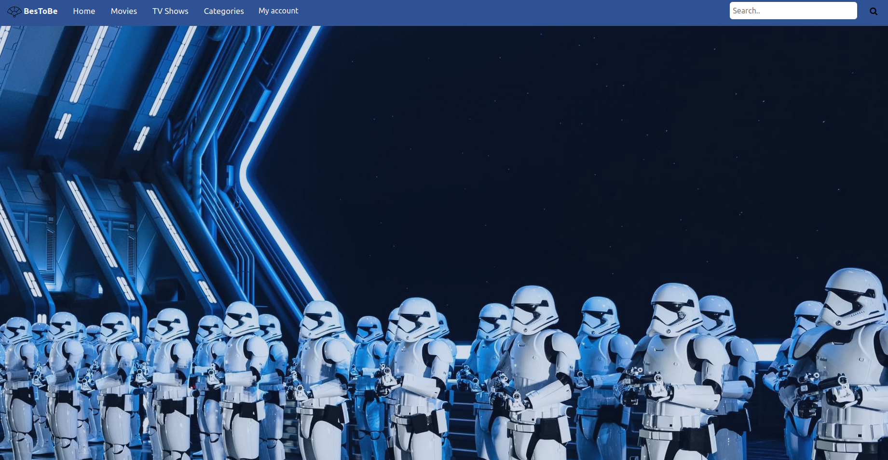
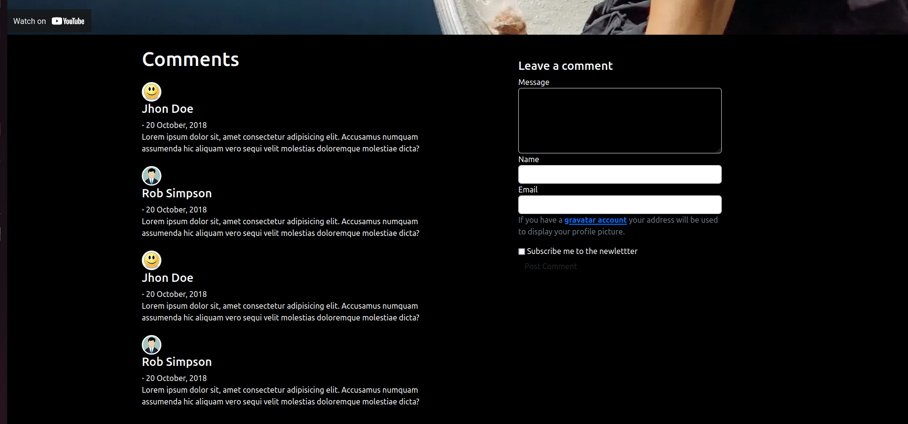
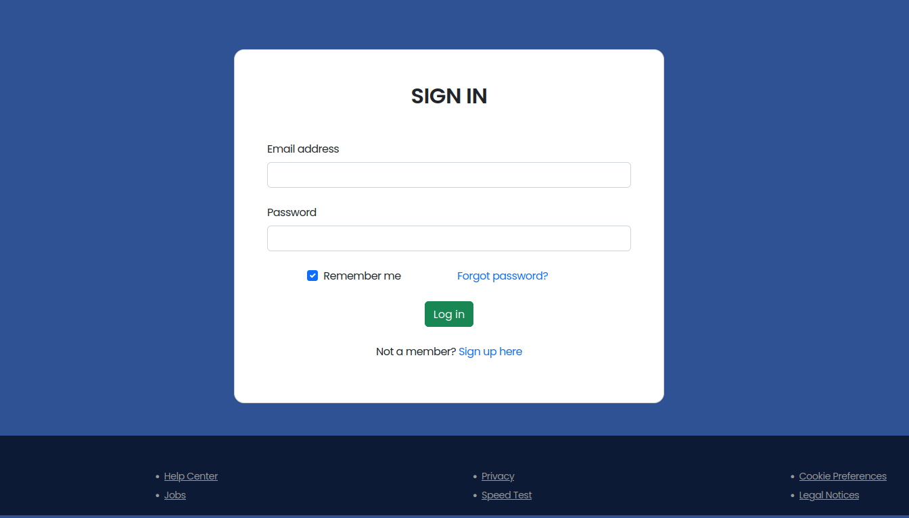

# Getflix Project

### Team collaborators: 
- Sophie Cheng
- Bhama Guruswami
- Jilani Nezroug
- Arianna Telesca

## The mission:
In this exercise, we created a Streaming site in html / css, javascript and php.

We were inspired by Netflix, Amazon Prime Video, Youtube...  The goal is to display a catalog of movies and TV series.

#### Where: BeCode Brussels
#### When: 5 August 2022
#### Technologies used: HTML/CSS/Javascript/PHP

### Must-have features:
- A session system: registration, connection / disconnection.
- Different rights: registrants have the right to comment on the content. You can add other rights depending on the different types of users.
- Include a search bar and sort by filters. 
- Make a secure code. 
- Deploy the site. PHP is not supported by github, find free alternatives.

## The project: BesToBe
We decide to create a platform to watch the best videos on youtube. The name is **BesToBe**. 
We would create a easier way to find only the best of youtube with a good catalog and functionals filters.
The videos are divided in categories (as playlist) and only registered users can comments.  

To do it we use the **Youtube Data api** connect with php language.

### Team roles:
- Backend: Sophie and Arianna
- Frontend: Bhama
- Project manager: Jilani

### Preview of the project
#### Main Page
  

### Comments section
  

### Sign in page

